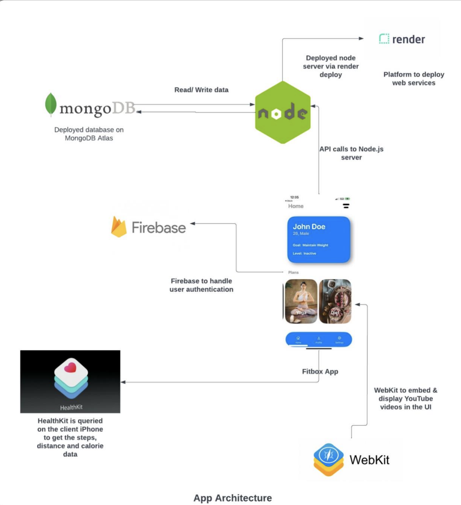
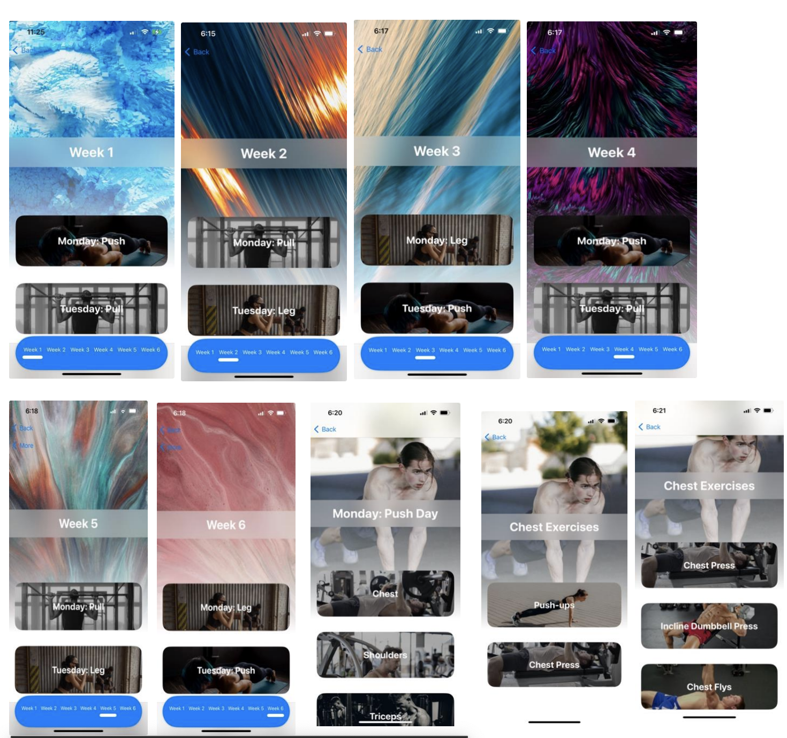
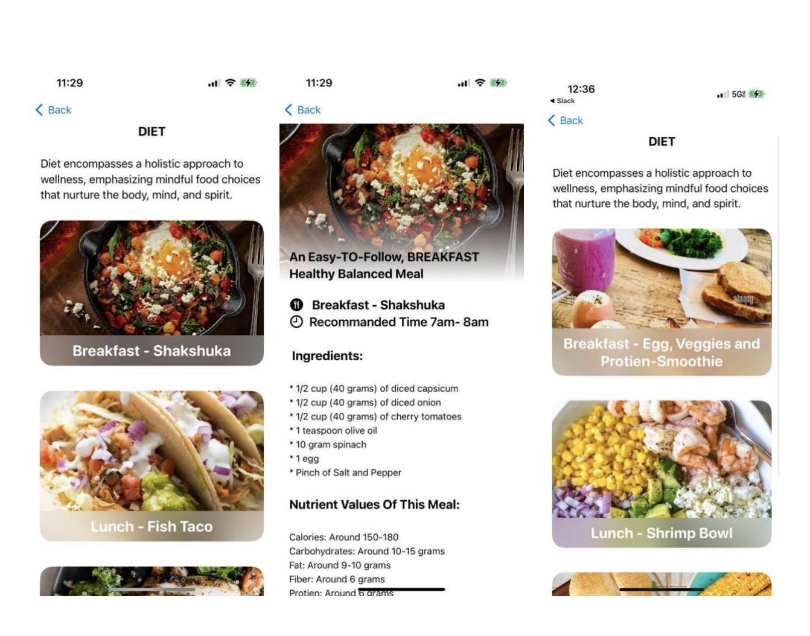

# iOS-FitnessApp

# INTRODUCTION
The Personalized Fitness App is designed to help individuals overcome workout challenges and maintain a consistent fitness routine. Many struggle with busy schedules, lack of guidance, and motivation hurdles, making it difficult to stay committed to their health goals.

This app leverages data-driven personalization and modern technology to deliver customized workout plans, real-time progress tracking, and tailored nutrition strategies, ensuring an engaging and effective fitness journey.

## ✨ Key Features:

✅ Personalized Workout Plans – AI-driven recommendations based on user goals and fitness levels.

✅ Real-Time Progress Tracking – Monitor workouts, achievements, and improvements with insightful analytics.

✅ Motivation & Accountability – Smart reminders and goal-setting features to keep users engaged.

✅ Nutrition & Diet Guidance – Personalized meal suggestions to complement workout goals.

✅ Intuitive UI/UX – Seamless navigation and a visually appealing interface built with React Native and Tailwind CSS.

✅ Cross-Platform Compatibility – Works on both iOS and Android for a consistent mobile experience.

✅ Secure Authentication & Data Storage – Firebase integration ensures user privacy and data security.

✅ Performance Optimizations – Lazy loading, caching, and efficient state management with Redux for a smooth experience.

By addressing common fitness barriers such as time constraints, lack of motivation, and ineffective planning, the Personalized Fitness App makes maintaining an active and healthy lifestyle more achievable and enjoyable.

## 🛠️ Tools and Technology

Frontend Development:
React Native – For building cross-platform mobile UI.
TypeScript – Ensures type safety and better maintainability.
Tailwind CSS – Used for styling and maintaining UI consistency.
Redux – Handles global state management efficiently, optimizing API calls.
Firebase – Provides secure authentication and real-time data handling.
SwiftUI – For developing iOS UI components.
Swift – Used for custom data models, controllers, and service classes.
Xcode – IDE for iOS app development, testing, and simulations.

Backend & Database:
Node.js – Backend server for API calls, managing business logic.
Express.js – Lightweight framework for handling API requests efficiently.
MongoDB Atlas – NoSQL database to store user progress and workout data.
Render – Cloud platform used for backend deployment.

Performance & Optimization:
Lazy Loading & Caching – Reduces app load time and improves performance.
API Optimization – Enhances response time by reducing unnecessary calls.
Jest & React Native Testing Library – Used for unit and component testing.

# 📌 CONCLUSION
The Personalized Fitness App is more than just a workout tracker—it’s a comprehensive fitness companion designed to help users stay motivated, track progress, and achieve their health goals. With AI-driven workout plans, real-time analytics, and an engaging UI, the app makes fitness accessible, personalized, and sustainable for users of all levels.

By leveraging modern technology and intuitive design, the app not only enhances the fitness experience but also adapts to individual needs, making workouts more efficient and enjoyable. Whether you're a beginner looking to start a fitness journey or an athlete aiming to optimize performance, this app serves as a reliable guide for long-term success.

In essence, the Personalized Fitness App fosters a healthier, more empowered community, helping users take control of their well-being and build lasting fitness habits.

